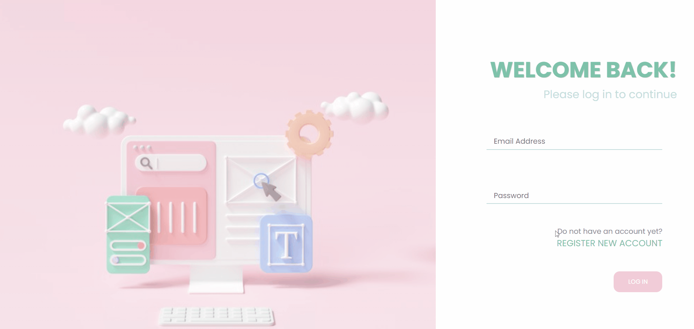

# MVC (Becode2U)
Using the MVC structure with the connection of database to build our in-class exercise submission portal - **Becode2U**. 
Users can register and login to an account as a coach or student. Different functions and information will be shown according to the accounts. 

### Demo

  

---

## Functions
 

- The coaches have the access to creating new challenges for students, and the students can overcast the exercise list and submit the GitHub URL to the coaches. 
- The schedule and email reminder of the Watch (in-class presentations) also built for both users.
  
---
## Contributors
 
We worked closely as a team and contributed together in various sections. At the same time, we also assigned different functions to each other. 

- [Basile](https://github.com/basileLeroy) built up the login and register system and worked closely with each other on the MVC structures.

- [Giomayra](https://github.com/grb-ds) constructed the database structure with the linkage of foreign keys. She also provided a lot of guidance on the MVC structure among the team.

- [Wing](https://github.com/chevtong) was responsible for the display of the database information on the landing page of users and the overall UX design with stylings. 
  

---
## Tools
 

- Php
- MySql
- [XAMPP](https://www.apachefriends.org/index.html)
- [FontAwsome](https://fontawesome.com/)
- Visual Studio Code 
- PhpStorm